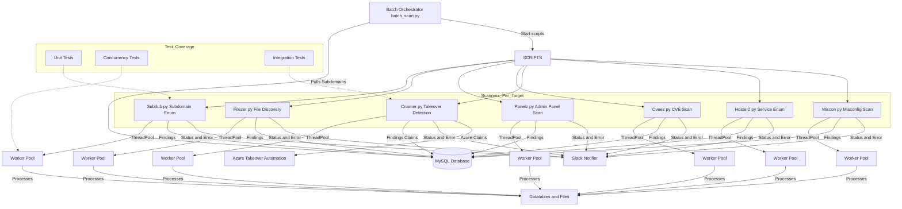

# Thadius

_A Python-driven automation and notification engine featuring secure, scalable, and concurrent job execution with real-world security assurance._

---

## 📈 System Architecture

**Key Components:**

- **Job Scheduler:** Handles all cron-like and ad-hoc tasks using `schedule` or `APScheduler`.
- **Worker Pool:** Manages concurrency via Python's `ThreadPoolExecutor`, processing jobs from a thread-safe queue.
- **Datatables & MySQL Storage:**  
  - **Datatables**: In-memory data manipulation (e.g., with Pandas or custom classes).  
  - **MySQL**: Reliable persistent storage for results, job configs, and logs.
- **Slack Integration:** Automated timely notifications using `slack_sdk`.
- **Extensibility:** Designed for additional integrations and scaling.
- **Testing:**  
  - **Unit:** Mocks for DB and Slack.  
  - **Integration/E2E:** Covers full flows across components.  
  - **Threading/Performance:** Stress tests for race conditions and stability.

---

## 🛡️ Security Achievements

Thadius was built and operated with a security-first approach, directly informed by my ongoing offensive security research and real bug bounty impact.

### 🔒 [View my HackerOne Profile →](https://hackerone.com/atoma/hacktivity?type=user)

**Select Bounty Highlights:**
- FanDuel: $1,000
- AT&T: $750
- Upserve: $300

**Vulnerability Experience:**

| CWE | Vulnerability Type                       | Submissions | Bounties | Severity Highlights |
|-----|-----------------------------------------|-------------|----------|--------------------|
| 200 | Information Disclosure                  | 20          | $300     | -                  |
| 287 | Improper Authentication (Generic)       | 6           | $750     | -                  |
| 284 | Improper Access Control (Generic)       | 5           | $100     | 1 Critical         |
| 352 | Cross-Site Request Forgery (CSRF)       | 5           | -        | -                  |
| 79  | Cross-site Scripting (XSS) - Reflected  | 5           | -        | -                  |
| 22  | Path Traversal                          | 4           | -        | 1 Critical         |
| 601 | Open Redirect                           | 4           | -        | -                  |
| 918 | Server-Side Request Forgery (SSRF)      | 4           | -        | -                  |
| 260 | Password in Configuration File          | 2           | $50      | -                  |

**OWASP Top 10 2017 Coverage:**
- A2: Broken Authentication (3)
- A5: Broken Access Control (4)
- A6: Security Misconfiguration (1)
- A7: Cross-Site Scripting (1)

**Bug Bounty Report Examples:**
- Path Traversal (Critical)
- Improper Access Control (Critical)
- Information Disclosure
- Improper Authentication

> _I apply a security mindset and lessons learned from real-world offensive testing to every codebase I own—including Thadius._

---

## 🚦 Testing Methodology

- **Unit Testing:** Isolates core logic, mocks all integrations.
- **Integration/E2E:** Validates workflows with real databases (test), and full notification loops.
- **Concurrency & Race Tests:** Uses stress scenarios to validate thread safety.

---

## 🤖 Technologies

- Python 3.x, threading/pools
- Pandas
- MySQL (with SQLAlchemy or native connector)
- Slack SDK
- pytest, unittest

---

## 🌟 Contact

- **Security, Collaboration, or Consultation:**  
  [atoma on HackerOne](https://hackerone.com/atoma/hacktivity?type=user)

---

## 📜 License

[MIT](LICENSE)
