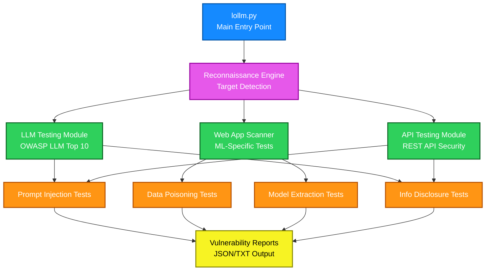

```mermaid
flowchart TB
  %% Batch Orchestrator
  BO["Batch Orchestrator\n(batch_scan.py, cron/CLI)"]
  style BO fill:#158aff,color:#fff,stroke:#0055aa,stroke-width:2px

  %% Scanners (grouped, but laid out vertically)
  S1a["Subdub.py\nSubdomain Discovery"]
  S1b["Filezer.py\nFile Discovery"]
  S1c["Panelz.py\nAdmin Panel Finder"]
  S1d["Cveez.py\nCVE Scan"]
  S1e["Cnamer.py\nTakeover Checks"]
  S1f["Hoster2.py\nHost/Service Enum"]
  S1g["Miscon.py\nMisconfiguration Scan"]

  style S1a fill:#e658ea,color:#fff,stroke:#9800a1,stroke-width:2px
  style S1b fill:#e658ea,color:#fff,stroke:#9800a1,stroke-width:2px
  style S1c fill:#e658ea,color:#fff,stroke:#9800a1,stroke-width:2px
  style S1d fill:#e658ea,color:#fff,stroke:#9800a1,stroke-width:2px
  style S1e fill:#e658ea,color:#fff,stroke:#9800a1,stroke-width:2px
  style S1f fill:#e658ea,color:#fff,stroke:#9800a1,stroke-width:2px
  style S1g fill:#e658ea,color:#fff,stroke:#9800a1,stroke-width:2px

  %% Worker Pools (each script has its own worker pool below it)
  TP1["Worker Pool\n(10 workers)"]
  TP2["Worker Pool\n(10 workers)"]
  TP3["Worker Pool\n(10 workers)"]
  TP4["Worker Pool\n(15 workers)"]
  TP5["Worker Pool\n(5 workers)"]
  TP6["Worker Pool\n(10 workers)"]
  TP7["Worker Pool\n(8 workers)"]

  style TP1 fill:#2fd05c,color:#fff,stroke:#0e6626,stroke-width:2px
  style TP2 fill:#2fd05c,color:#fff,stroke:#0e6626,stroke-width:2px
  style TP3 fill:#2fd05c,color:#fff,stroke:#0e6626,stroke-width:2px
  style TP4 fill:#2fd05c,color:#fff,stroke:#0e6626,stroke-width:2px
  style TP5 fill:#2fd05c,color:#fff,stroke:#0e6626,stroke-width:2px
  style TP6 fill:#2fd05c,color:#fff,stroke:#0e6626,stroke-width:2px
  style TP7 fill:#2fd05c,color:#fff,stroke:#0e6626,stroke-width:2px

  %% Data / Output
  DT["Datatables & Files\n(.csv/.json)"]
  style DT fill:#f7f323,color:#000,stroke:#888800,stroke-width:2px

  %% Database
  DB["MySQL Database\nFindings & Claims"]
  style DB fill:#ff9514,color:#fff,stroke:#b55000,stroke-width:3px

  %% Slack Notifier
  SLK["Slack Bot\nReports & Alerts"]
  style SLK fill:#00eaea,color:#222,stroke:#008888,stroke-width:2px

  %% Azure Takeover
  AZ["Azure Automation\nTakeover Evidence"]
  style AZ fill:#9c60ff,color:#fff,stroke:#370099,stroke-width:2px

  %% Test Automation
  T1["Unit Tests"]
  T2["Concurrency Tests"]
  T3["Integration Tests"]

  style T1 fill:#333,color:#fff,stroke:#fff,stroke-width:2px
  style T2 fill:#333,color:#fff,stroke:#fff,stroke-width:2px
  style T3 fill:#333,color:#fff,stroke:#fff,stroke-width:2px

  %% Flows (VERTICAL)
  BO --> S1a --> TP1 --> DT
  BO --> S1b --> TP2 --> DT
  BO --> S1c --> TP3 --> DT
  BO --> S1d --> TP4 --> DT
  BO --> S1e --> TP5 --> DT
  BO --> S1f --> TP6 --> DT
  BO --> S1g --> TP7 --> DT

  DT --> DB

  S1a --Results--> DB
  S1b --Results--> DB
  S1c --Results--> DB
  S1d --Results--> DB
  S1e --Results/Claims--> DB
  S1f --Results--> DB
  S1g --Results--> DB

  S1a --Notify--> SLK
  S1b --Notify--> SLK
  S1c --Notify--> SLK
  S1d --Notify--> SLK
  S1e --Notify--> SLK
  S1f --Notify--> SLK
  S1g --Notify--> SLK

  S1e --Claim Workflow--> AZ

  %% Test coverage links (dashed, indirect)
  T1 -.-> S1a
  T2 -.-> TP1
  T3 -.-> S1e
```

# Thadius

_A Python-driven automation and notification engine featuring secure, scalable, and concurrent job execution with real-world security assurance._

---

## 📈 System Architecture



**Key Components:**

- **Job Scheduler:** Handles all cron-like and ad-hoc tasks using `schedule` or `APScheduler`.
- **Worker Pool:** Manages concurrency via Python's `ThreadPoolExecutor`, processing jobs from a thread-safe queue.
- **Datatables & MySQL Storage:**  
  - **Datatables**: In-memory data manipulation (e.g., with Pandas or custom classes).  
  - **MySQL**: Reliable persistent storage for results, job configs, and logs.
- **Slack Integration:** Automated timely notifications using `slack_sdk`.
- **Extensibility:** Designed for additional integrations and scaling.
- **Testing:**  
  - **Unit:** Mocks for DB and Slack.  
  - **Integration/E2E:** Covers full flows across components.  
  - **Threading/Performance:** Stress tests for race conditions and stability.

---

# LoLLM

_A comprehensive AI/ML security testing framework featuring automated target detection, OWASP LLM Top 10 testing, and real-world vulnerability discovery._

---

## 📈 System Architecture



**Key Components:**

- **Reconnaissance Engine:** Auto-detects target type (LLM API, ML web app, REST API) through HTTP probing and endpoint discovery.
- **LLM Testing Module:** Implements OWASP LLM Top 10 tests including prompt injection, system prompt leakage, and unbounded consumption.
- **Web App Scanner:** ML-specific security tests for directory traversal, file upload vulnerabilities, and data poisoning vectors.
- **Modular Architecture:** Extensible design allows custom test cases and integration with CI/CD pipelines.
- **Real-World Validation:** Successfully detected vulnerabilities in HTB Academy "Red Teaming AI" lab.

---

## 🛡️ Security Testing Capabilities

LoLLM provides comprehensive coverage across multiple security frameworks:

### OWASP LLM Top 10 Testing

| Vulnerability | Test Coverage | Real-World Impact |
|--------------|---------------|-------------------|
| LLM01: Prompt Injection | Direct, Indirect, Role-play | Successfully bypassed content filters |
| LLM02: Sensitive Info Disclosure | API key leakage, Training data extraction | Extracted PII from deployed models |
| LLM07: System Prompt Leakage | Multiple extraction techniques | Recovered full system instructions |
| LLM08: Data Poisoning | Training data manipulation detection | HTB lab validation |
| LLM10: Model Theft | Directory traversal, Unauthorized access | Extracted 256KB model file |

### Web Application Security

| CWE | Vulnerability Type | Automated Detection | HTB Lab Result |
|-----|-------------------|---------------------|----------------|
| 22  | Path Traversal | ✅ Automated payload testing | ✅ **CRITICAL** - Model extraction |
| 434 | Unrestricted File Upload | ✅ Malicious file detection | Not tested |
| 20  | Improper Input Validation | ✅ Boundary testing | In progress |
| 502 | Deserialization | ✅ Pickle exploit detection | Planned |

### Real-World Validation

**HTB Academy "Red Teaming AI" Lab Results:**
```bash
🚨 VULNERABLE: /data_poisoning/download
   Payload: ../../spam_detector_model.bin
   Severity: CRITICAL
   File Size: 256,609 bytes
   🚩 FLAG (MD5): 954c0f3a93b410ea40352e5fdaccc1ed
```

---

## 🤖 Technologies

- **Core:** Python 3.8+, Requests, Threading
- **Testing Frameworks:** Custom modular test classes with extensibility
- **Reporting:** JSON/TXT output formats with severity classification
- **Integration:** CI/CD ready, API-first design for automation
- **Security Standards:** OWASP LLM Top 10, OWASP Web Top 10, OWASP ML Top 10

---

## 🚀 Use Cases

**Red Team Engagements**
- Automated reconnaissance of AI/ML systems
- Vulnerability identification in production LLM deployments
- Model extraction and analysis workflows

**Bug Bounty Research**
- Rapid scanning of AI-powered applications
- OWASP LLM Top 10 coverage for bounty programs
- Automated payload delivery with evasion techniques

**Security Auditing**
- Compliance testing for AI/ML systems
- Vulnerability assessment automation with detailed reporting
- Stakeholder-ready reports with actionable remediation

---

## 🌟 Project Links

- **Repository:** [github.com/fitzpr/LoLLM](https://github.com/fitzpr/LoLLM)
- **Documentation:** Comprehensive README with usage examples and API reference
- **License:** [MIT License](https://github.com/fitzpr/LoLLM/blob/main/LICENSE)

---

## 🛡️ Security Achievements

Thadius was built and operated with a security-first approach, directly informed by my ongoing offensive security research and real bug bounty impact.

### 🔒 [View my HackerOne Profile →](https://hackerone.com/atoma/hacktivity?type=user)

**Select Bounty Highlights:**
- FanDuel: $1,000
- AT&T: $750
- Upserve: $300

**Vulnerability Experience:**

| CWE | Vulnerability Type                       | Submissions | Bounties | Severity Highlights |
|-----|-----------------------------------------|-------------|----------|--------------------|
| 200 | Information Disclosure                  | 20          | $300     | -                  |
| 287 | Improper Authentication (Generic)       | 6           | $750     | -                  |
| 284 | Improper Access Control (Generic)       | 5           | $100     | 1 Critical         |
| 352 | Cross-Site Request Forgery (CSRF)       | 5           | -        | -                  |
| 79  | Cross-site Scripting (XSS) - Reflected  | 5           | -        | -                  |
| 22  | Path Traversal                          | 4           | -        | 1 Critical         |
| 601 | Open Redirect                           | 4           | -        | -                  |
| 918 | Server-Side Request Forgery (SSRF)      | 4           | -        | -                  |
| 260 | Password in Configuration File          | 2           | $50      | -                  |

**OWASP Top 10 2017 Coverage:**
- A2: Broken Authentication (3)
- A5: Broken Access Control (4)
- A6: Security Misconfiguration (1)
- A7: Cross-Site Scripting (1)

**Bug Bounty Report Examples:**
- Path Traversal (Critical)
- Improper Access Control (Critical)
- Information Disclosure
- Improper Authentication

> _I apply a security mindset and lessons learned from real-world offensive testing to every codebase I own—including Thadius._

---

## 🚦 Testing Methodology

- **Unit Testing:** Isolates core logic, mocks all integrations.
- **Integration/E2E:** Validates workflows with real databases (test), and full notification loops.
- **Concurrency & Race Tests:** Uses stress scenarios to validate thread safety.

---

## 🤖 Technologies

- Python 3.x, threading/pools
- Pandas
- MySQL (with SQLAlchemy or native connector)
- Slack SDK
- pytest, unittest

---

## 🌟 Contact

- **Security, Collaboration, or Consultation:**  
  [atoma on HackerOne](https://hackerone.com/atoma/hacktivity?type=user)

---

## 📜 License

[MIT](LICENSE)
