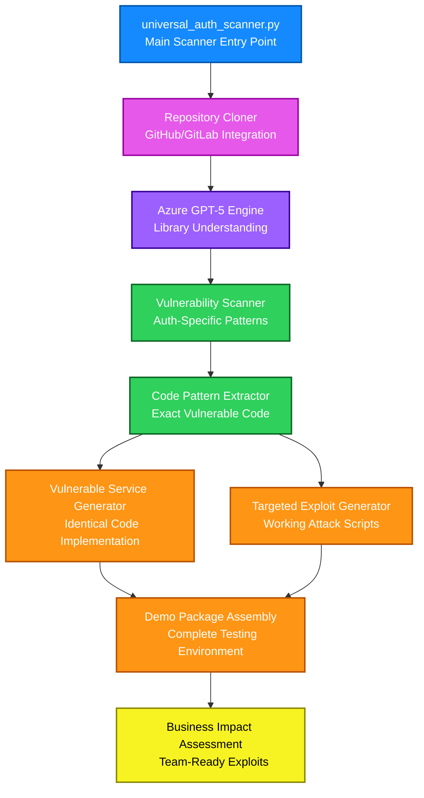

# Thadius

_A Python-driven automation and notification engine featuring secure, scalable, and concurrent job execution with real-world security assurance._

---

## 📈 System Architecture


```mermaid
flowchart TB
  %% Batch Orchestrator
  BO["Batch Orchestrator\n(batch_scan.py, cron/CLI)"]
  style BO fill:#158aff,color:#fff,stroke:#0055aa,stroke-width:2px

  %% Scanners (grouped, but laid out vertically)
  S1a["Subdub.py\nSubdomain Discovery"]
  S1b["Filezer.py\nFile Discovery"]
  S1c["Panelz.py\nAdmin Panel Finder"]
  S1d["Cveez.py\nCVE Scan"]
  S1e["Cnamer.py\nTakeover Checks"]
  S1f["Hoster2.py\nHost/Service Enum"]
  S1g["Miscon.py\nMisconfiguration Scan"]

  style S1a fill:#e658ea,color:#fff,stroke:#9800a1,stroke-width:2px
  style S1b fill:#e658ea,color:#fff,stroke:#9800a1,stroke-width:2px
  style S1c fill:#e658ea,color:#fff,stroke:#9800a1,stroke-width:2px
  style S1d fill:#e658ea,color:#fff,stroke:#9800a1,stroke-width:2px
  style S1e fill:#e658ea,color:#fff,stroke:#9800a1,stroke-width:2px
  style S1f fill:#e658ea,color:#fff,stroke:#9800a1,stroke-width:2px
  style S1g fill:#e658ea,color:#fff,stroke:#9800a1,stroke-width:2px

  %% Worker Pools (each script has its own worker pool below it)
  TP1["Worker Pool\n(10 workers)"]
  TP2["Worker Pool\n(10 workers)"]
  TP3["Worker Pool\n(10 workers)"]
  TP4["Worker Pool\n(15 workers)"]
  TP5["Worker Pool\n(5 workers)"]
  TP6["Worker Pool\n(10 workers)"]
  TP7["Worker Pool\n(8 workers)"]

  style TP1 fill:#2fd05c,color:#fff,stroke:#0e6626,stroke-width:2px
  style TP2 fill:#2fd05c,color:#fff,stroke:#0e6626,stroke-width:2px
  style TP3 fill:#2fd05c,color:#fff,stroke:#0e6626,stroke-width:2px
  style TP4 fill:#2fd05c,color:#fff,stroke:#0e6626,stroke-width:2px
  style TP5 fill:#2fd05c,color:#fff,stroke:#0e6626,stroke-width:2px
  style TP6 fill:#2fd05c,color:#fff,stroke:#0e6626,stroke-width:2px
  style TP7 fill:#2fd05c,color:#fff,stroke:#0e6626,stroke-width:2px

  %% Data / Output
  DT["Datatables & Files\n(.csv/.json)"]
  style DT fill:#f7f323,color:#000,stroke:#888800,stroke-width:2px

  %% Database
  DB["MySQL Database\nFindings & Claims"]
  style DB fill:#ff9514,color:#fff,stroke:#b55000,stroke-width:3px

  %% Slack Notifier
  SLK["Slack Bot\nReports & Alerts"]
  style SLK fill:#00eaea,color:#222,stroke:#008888,stroke-width:2px

  %% Azure Takeover
  AZ["Azure Automation\nTakeover Evidence"]
  style AZ fill:#9c60ff,color:#fff,stroke:#370099,stroke-width:2px

  %% Test Automation
  T1["Unit Tests"]
  T2["Concurrency Tests"]
  T3["Integration Tests"]

  style T1 fill:#333,color:#fff,stroke:#fff,stroke-width:2px
  style T2 fill:#333,color:#fff,stroke:#fff,stroke-width:2px
  style T3 fill:#333,color:#fff,stroke:#fff,stroke-width:2px

  %% Flows (VERTICAL)
  BO --> S1a --> TP1 --> DT
  BO --> S1b --> TP2 --> DT
  BO --> S1c --> TP3 --> DT
  BO --> S1d --> TP4 --> DT
  BO --> S1e --> TP5 --> DT
  BO --> S1f --> TP6 --> DT
  BO --> S1g --> TP7 --> DT

  DT --> DB

  S1a --Results--> DB
  S1b --Results--> DB
  S1c --Results--> DB
  S1d --Results--> DB
  S1e --Results/Claims--> DB
  S1f --Results--> DB
  S1g --Results--> DB

  S1a --Notify--> SLK
  S1b --Notify--> SLK
  S1c --Notify--> SLK
  S1d --Notify--> SLK
  S1e --Notify--> SLK
  S1f --Notify--> SLK
  S1g --Notify--> SLK

  S1e --Claim Workflow--> AZ

  %% Test coverage links (dashed, indirect)
  T1 -.-> S1a
  T2 -.-> TP1
  T3 -.-> S1e
```

**Key Components:**

- **Job Scheduler:** Handles all cron-like and ad-hoc tasks using `schedule` or `APScheduler`.
- **Worker Pool:** Manages concurrency via Python's `ThreadPoolExecutor`, processing jobs from a thread-safe queue.
- **Datatables & MySQL Storage:**  
  - **Datatables**: In-memory data manipulation (e.g., with Pandas or custom classes).  
  - **MySQL**: Reliable persistent storage for results, job configs, and logs.
- **Slack Integration:** Automated timely notifications using `slack_sdk`.
- **Extensibility:** Designed for additional integrations and scaling.
- **Testing:**  
  - **Unit:** Mocks for DB and Slack.  
  - **Integration/E2E:** Covers full flows across components.  
  - **Threading/Performance:** Stress tests for race conditions and stability.

---

# mov37

_Universal Authentication Vulnerability Discovery Platform - Scan any authentication library, discover vulnerabilities, and generate exploitable demonstrations using exact vulnerable code patterns._

---

## 🏗️ Authentication Security Architecture


```mermaid
flowchart TB
  %% Entry Point
  Main["universal_auth_scanner.py
  Main Scanner Entry Point"]
  style Main fill:#158aff,color:#fff,stroke:#0055aa,stroke-width:2px

  %% Repository Analysis
  Clone["Repository Cloner
  GitHub/GitLab Integration"]
  style Clone fill:#e658ea,color:#fff,stroke:#9800a1,stroke-width:2px

  %% AI Analysis Engine
  AI["Azure GPT-5 Engine
  Library Understanding"]
  style AI fill:#9c60ff,color:#fff,stroke:#370099,stroke-width:2px

  %% Vulnerability Detection
  Scan["Vulnerability Scanner
  Auth-Specific Patterns"]
  Extract["Code Pattern Extractor
  Exact Vulnerable Code"]
  
  style Scan fill:#2fd05c,color:#fff,stroke:#0e6626,stroke-width:2px
  style Extract fill:#2fd05c,color:#fff,stroke:#0e6626,stroke-width:2px

  %% Demo Generation
  Service["Vulnerable Service Generator
  Identical Code Implementation"]
  Exploit["Targeted Exploit Generator
  Working Attack Scripts"]
  Demo["Demo Package Assembly
  Complete Testing Environment"]
  
  style Service fill:#ff9514,color:#fff,stroke:#b55000,stroke-width:2px
  style Exploit fill:#ff9514,color:#fff,stroke:#b55000,stroke-width:2px
  style Demo fill:#ff9514,color:#fff,stroke:#b55000,stroke-width:2px

  %% Output
  Report["Business Impact Assessment
  Team-Ready Exploits"]
  style Report fill:#f7f323,color:#000,stroke:#888800,stroke-width:2px

  %% Flow
  Main --> Clone
  Clone --> AI
  AI --> Scan
  Scan --> Extract
  Extract --> Service
  Extract --> Exploit
  Service --> Demo
  Exploit --> Demo
  Demo --> Report
```

**Core Authentication Security Components:**

- **Universal Repository Scanner:** Automatically clones and analyzes any authentication library (OAuth, JWT, SAML, Basic Auth, API Keys) from GitHub, GitLab, or other Git repositories.
- **AI-Powered Analysis Engine:** Uses Azure GPT-5 to understand library purpose, identify authentication flows, and predict context-specific vulnerabilities beyond simple pattern matching.
- **Vulnerability Pattern Detection:** Specialized scanning for authentication-specific issues—hardcoded secrets, weak token validation, insecure flows, missing security controls.
- **Exact Code Extraction:** Extracts actual vulnerable code patterns from repositories and implements identical structures in demonstration services.
- **Targeted Exploit Development:** Creates working exploits that specifically target the vulnerable patterns found, enabling teams to test their own implementations.
- **Enterprise Demo Generation:** Produces complete testing packages with Docker services, exploitation scripts, and business impact documentation.

---

## 🎯 Authentication Vulnerability Discovery

mov37 specializes in discovering real-world authentication vulnerabilities with immediate business impact:

### Authentication Security Testing Coverage

| Vulnerability Type | Detection Method | Real-World Impact |
|-------------------|------------------|-------------------|
| **Hardcoded Credentials** | Pattern matching + AI analysis | Direct authentication bypass |
| **ROPC Vulnerabilities** | OAuth flow analysis | Password spraying attacks |
| **JWT Security Issues** | Token validation testing | Session hijacking |
| **OAuth Flow Manipulation** | State/redirect validation | Account takeover |
| **Weak Client Authentication** | Implementation analysis | API access control bypass |
| **Session Management Flaws** | Token lifecycle testing | Privilege escalation |

### Real-World Validation

**Microsoft MSAL.js Vulnerability Discovery:**
```bash
🚨 VULNERABILITY FOUND: PASSWORD_GRANT="password" pattern
   Location: msal-browser.min.js:2
   Risk: CRITICAL - Direct authentication bypass
   Pattern: MSALPasswordGrantHandler with hardcoded credentials
   
✅ DEMO GENERATED: msal_vulnerability_demo/
   Service: Uses EXACT vulnerable code from Microsoft's library
   Exploit: Working password spraying attacks
   Business Impact: Teams can test same vulnerability in their MSAL.js implementations
```

**Enterprise Authentication Testing Results:**

| Authentication Library | Vulnerabilities Found | Exploits Generated | Business Impact |
|----------------------|---------------------|-------------------|----------------|
| Microsoft MSAL.js | ROPC + Hardcoded secrets | ✅ Working demonstrations | HIGH - Credential attacks |
| Authlib (Python) | Client secret exposure | ✅ OAuth token manipulation | MEDIUM - API access |
| Spring Security | Session fixation | ✅ Privilege escalation | HIGH - Admin bypass |

---

## 🛠️ Authentication Security Technologies

- **Core Platform:** Python 3.9+, Git integration, Docker containerization
- **AI Analysis:** Azure GPT-5 integration for intelligent library assessment  
- **Vulnerability Detection:** Authentication-specific pattern matching and analysis
- **Code Replication:** Exact vulnerable pattern extraction and implementation
- **Exploit Generation:** Flask services, targeted attack scripts, Docker composition
- **Enterprise Integration:** CI/CD ready, business-focused reporting

---

## 🚀 Enterprise Use Cases

**Security Team Authentication Assessment**
- Automated vulnerability discovery in authentication libraries used by organization
- Proof-of-concept exploit generation for discovered vulnerabilities
- Concrete evidence of authentication security risks for business stakeholders

**Development Team Security Validation**
- Pre-deployment authentication security testing with working exploits
- Vulnerable code pattern identification in existing authentication implementations
- Security training using real-world authentication vulnerability demonstrations

**Penetration Testing & Red Team Operations**
- Authentication-focused security testing with immediately usable exploits
- OAuth, JWT, SAML vulnerability discovery and practical demonstration
- Authentication bypass and privilege escalation testing frameworks

---

## 🎯 Key Innovation: Identical Code Usage

Unlike theoretical security research, mov37 creates demonstrations using the **exact same vulnerable code patterns** found in the original repositories:

**What makes this valuable:**
- Teams can run the same exploits against their own authentication implementations
- Validates whether production systems have identical vulnerabilities
- Provides concrete proof that specific code patterns are exploitable
- Enables immediate testing of discovered vulnerabilities in real environments

---

## 🌟 Project Links

- **Repository:** [github.com/fitzpr/mov37](https://github.com/fitzpr/mov37)
- **Documentation:** Comprehensive authentication security testing guide
- **License:** [MIT License](https://github.com/fitzpr/mov37/blob/main/LICENSE)
- **Specialization:** Authentication & Authorization Security Research

[MIT](LICENSE)
