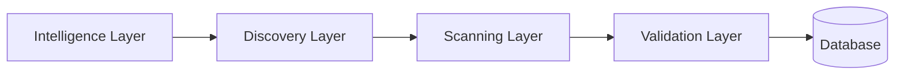

# Hi there 👋 I'm Rob Fitzpatrick

> Security automation enthusiast • CTF competitor • Bug bounty hunter based in Dublin 🇮🇪

---

## 🔧 Current Project: Thadius

**Advanced Bug Bounty Automation Platform** - Comprehensive system for vulnerability research, target discovery, and intelligent scanning.

### 🚀 Key Features
- **🕵️ Intelligence Automation** - CVE monitoring, security research tracking, automated template generation
- **📡 Real-Time Discovery** - Certificate Transparency monitoring, continuous subdomain enumeration  
- **🎯 ML-Powered Scanning** - AI validation, false positive reduction, intelligent target prioritization
- **⚡ Parallel Processing** - Concurrent scanning architecture with database integration
- **🤖 Full Automation** - Hands-off operation with intelligent scheduling

### 🏗 Architecture Overview

```mermaid
graph LR
    A[Intelligence Layer] --> B[Discovery Layer]
    B --> C[Scanning Layer] 
    C --> D[Validation Layer]
    D --> E[(Database)]
```

**🎯 [Check out Thadius →](https://github.com/fitzpr/thadius)**

---

## 🛠 Tech Stack

**Languages:** Python, Bash, Go (tools)  
**Security:** Nuclei, Subfinder, HTTPx, Custom tooling  
**AI/ML:** OpenAI/Azure GPT models, HTTP response analysis  
**Infrastructure:** MySQL, Docker, Linux automation  
**Platforms:** DigitalOcean, Azure, GitHub Actions  

---

## 📊 Current Focus

- 🔍 **Automated vulnerability research** and template generation
- 📈 **ML-powered false positive reduction** in security scanning
- 🎯 **Real-time target discovery** via Certificate Transparency
- ⚡ **Scalable security automation** for bug bounty hunting

---

## 🤝 Let's Connect

- 💼 **LinkedIn:** Security automation & CTF discussions
- 🐦 **Twitter:** Bug bounty insights & security research
- 📧 **Email:** For collaboration opportunities
- 🏆 **CTF Teams:** Always interested in new challenges

---

💡 **"Automating security so hunters can focus on what matters most"**
